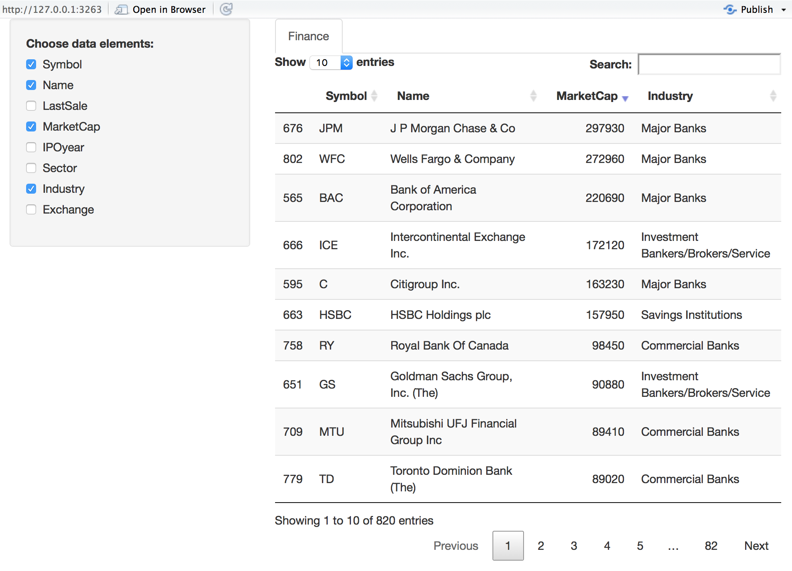

**Shiny** is an R framework in which you can set up browser-based interactive applications and use them to interact with the data. This approach results in a better understanding of models you may build in R. Full documentation and details are available at http://shiny.rstudio.com/

Preparing an application in **Shiny** requires creating the back end processing code, which has to be stored in a file named **server.R** and a front end graphical user interface (GUI), placed in a file named **ui.R**. Both these file names are mandated, as the **shiny** package will look for these files. One may also create a file called **app.R** in which both a *server* function and a *ui* function are embedded. To illustrate, we will create an interactive application to price options using the well-known Black-Scholes-Merton (1973) model. 

## The Black-Scholes-Merton (1973) model

The price of a call option in this model is given by the following formula
$$
C = S e^{-qT} \cdot N(d_1) - K e^{-rT} \cdot N(d_2)
$$
where 
$$ 
d_1 = \frac{\ln(S/K)+(r-q+v^2/2)T}{v \sqrt{T}}
$$
and $d_2 = d_1 - v \sqrt{T}$. Here $S$ is the stock price, $K$ is the strike price, $T$ is option maturity, $v$ is the annualized volatility of the stock, and $r$ is the continuous risk free rate of interest for maturity $T$. Finally, $q$ is the annual dividend rate, assuming it is paid continuously. 

Likewise, the formula for a put option is 
$$
C = K e^{-rT} \cdot N(-d_2) - S e^{-qT} \cdot N(-d_1) 
$$
and $d_1$ and $d_2$ are the same as for the call option. 

## The application program

Here is the code and it is stored in a file called **app.R**. 

```{r,eval=FALSE}
library(shiny)
library(plotly)
library(ggplot2)


##### SERVER #####

# Define server logic for random distribution application
server <- function(input, output) {
  
  #Generate Black-Scholes values
  BS = function(S,K,T,v,rf,dv) {
    d1 = (log(S/K) + (rf-dv+0.5*v^2)*T)/(v*sqrt(T))
    d2 = d1 - v*sqrt(T)
    bscall = S*exp(-dv*T)*pnorm(d1) - K*exp(-rf*T)*pnorm(d2)
    bsput = -S*exp(-dv*T)*pnorm(-d1) + K*exp(-rf*T)*pnorm(-d2)
    res = c(bscall,bsput)
  }
    
  #Call option price
  output$BScall <- renderText({ 
    #Get inputs
    S = input$stockprice
    K = input$strike
    T = input$maturity
    v = input$volatility
    rf = input$riskfreerate
    dv = input$divrate
    res = round(BS(S,K,T,v,rf,dv)[1],4)
  })

  #Put option price
  output$BSput <- renderText({ 
    #Get inputs
    S = input$stockprice
    K = input$strike
    T = input$maturity
    v = input$volatility
    rf = input$riskfreerate
    dv = input$divrate
    res = round(BS(S,K,T,v,rf,dv)[2],4)
  })

  #Call plot
  output$plotCall <- renderPlot({
    S = input$stockprice
    K = input$strike
    T = input$maturity
    v = input$volatility
    rf = input$riskfreerate
    dv = input$divrate
    vcall = NULL; vput = NULL
    strikes = seq(K-30,K+30)
    for (k in strikes) {
      vcall = c(vcall,BS(S,k,T,v,rf,dv)[1])
      vput = c(vput,BS(S,k,T,v,rf,dv)[2])
    }
    df = data.frame(strikes,vcall,vput)
    ggplot(df,aes(x=strikes,y=vcall)) + geom_point(color=strikes)
  }, height = 350, width = 600)

  #Put plot
  output$plotPut <- renderPlot({
    S = input$stockprice
    K = input$strike
    T = input$maturity
    v = input$volatility
    rf = input$riskfreerate
    dv = input$divrate
    vcall = NULL; vput = NULL
    strikes = seq(K-30,K+30)
    for (k in strikes) {
      vcall = c(vcall,BS(S,k,T,v,rf,dv)[1])
      vput = c(vput,BS(S,k,T,v,rf,dv)[2])
    }
    df = data.frame(strikes,vcall,vput)
    ggplot(df,aes(x=strikes,y=vput)) + geom_point(color=strikes)
  }, height = 350, width = 600)
  
  
}

##### UI #####

ui <- shinyUI(fluidPage(
  
  titlePanel("Black-Scholes-Merton (1973)"),
  
  sidebarLayout(
    sidebarPanel(
      numericInput('stockprice','Stock Price',100),
      numericInput('strike','Strike Price',100),
      sliderInput('maturity','Maturity (years)',min=0.1,max=10,value=1,step=0.01),
      sliderInput('volatility','Volatility',min=0.1,max=0.9,value=0.15,step=0.01),
      sliderInput('riskfreerate','Risk free rate',min=0.0,max=0.5,value=0.01,step=0.01),
      sliderInput('divrate','Dividend rate',min=0.0,max=0.25,value=0.01,step=0.01),
      hr(),
      p('Please refer to following for more details:',
        a("Black-Scholes (1973)", 
          href = "https://en.wikipedia.org/wiki/Black%E2%80%93Scholes_model")),
      hr()
    ),
  
    mainPanel(
      p('Call price'),
      textOutput("BScall"),
      hr(),
      p('Put price'),
      textOutput("BSput"),
      hr(),
      tabsetPanel(
        tabPanel("Calls", plotOutput("plotCall",width="100%")), 
        tabPanel("Puts", plotOutput("plotPut",width="100%")) 
      )
    )
  )  
))

##### Run #####
shinyApp(ui = ui, server = server)
```

## Running the App

To run the app, open the file **app.R** in RStudio and then execute **RunApp** from the menu. This app will generate the following screen. 


1. Note the sidebar panel, that allows numeric input for the stock price and the strike price. 
2. Note also the slider input for the other variables of the model. 
3. Changing the inputs results in automatic interactive updates in the output panel, both to call and put prices, as well as the plots. 
4. Look at the panel with the plots, it has two tabs, and one can click to switch between the plot for calls and the one for puts.

## Server section of the App

The server section has the following features (examine the code above). 

1. The packages used may be invoked at the top of the file, as they may be used by both the server and ui functions. 
2. Each external output is created by a separate function. The text output is carried out by a shiny function called **renderText** and the plots are generated by a function called **renderPlot**. 
3. One may also create subsidiary functions that do not generate external output, but are called by other functions inside the program. For example, the function **BS** in the code above implements the option pricing formula but does not return anything to the UI. 

## UI section of the App

The ui section has the following features (examine the code above). 

1. There are three panels: title, sidebar, main. This allows for a nice layout of inputs and outputs. In the example here, we use the sidebar panel to input values to the app, and the main panel to present outputs. 
2. All inputs are taken in to an object called **input** which is then accessed by the server section of the program. Different formats for the inputs are allowed and here we show numeric and slider inputs as examples. 
3. The output can be tabbed as is done for the plots. 

## Using the *reactive* mode in the app

The ui portion of the program takes input values and makes them available to the server section. We see that each function in the server section has to collect all the inputs for itself, and as a result the initialization of variables in this section occurs inside each function in a repetitive manner. In order to avoid this, and thereby shorten and speed up the code, we may use the inputs in *reactive* mode. What this means is that inputs are live and available globally to all functions in the server segment of the program. 

Here is the **ui.R** file from the reactive version. We see that is much the same as before. 

```{r,eval=FALSE}
##### UI #####
library(shiny)

fluidPage(
  
  titlePanel("Black-Scholes-Merton (1973)"),
  
  sidebarLayout(
    sidebarPanel(
      numericInput('stockprice','Stock Price',100),
      numericInput('strike','Strike Price',100),
      sliderInput('maturity','Maturity (years)',min=0.1,max=10,value=1,step=0.01),
      sliderInput('volatility','Volatility',min=0.1,max=0.9,value=0.15,step=0.01),
      sliderInput('riskfreerate','Risk free rate',min=0.0,max=0.5,value=0.01,step=0.01),
      sliderInput('divrate','Dividend rate',min=0.0,max=0.25,value=0.01,step=0.01),
      hr(),
      p('Please refer to following for more details:',
        a("Black-Scholes (1973)", 
          href = "https://en.wikipedia.org/wiki/Black%E2%80%93Scholes_model")),
      hr()
    ),
    
    mainPanel(
      p('Call price'),
      textOutput("BScall"),
      hr(),
      p('Put price'),
      textOutput("BSput"),
      hr(),
      tabsetPanel(
        tabPanel("Calls", plotOutput("plotCall",width="100%")), 
        tabPanel("Puts", plotOutput("plotPut",width="100%")) 
      )
    )
  )  
)
```

However, the **server.R** file is quite different, and it needed the Black-Scholes pricing funtion **BS** to be refactored to take reactive input, and we were then able to shorten the code considerably, see here. 

```{r,eval=FALSE}
library(shiny)
library(plotly)
library(ggplot2)


##### SERVER #####

# Define server logic for random distribution application
function(input, output) {
  
  #Generate Black-Scholes values
  BS = function(x) {
    S=x[1]; K=x[2]; T=x[3]; v=x[4]; rf=x[5]; dv=x[6]
    d1 = (log(S/K) + (rf-dv+0.5*v^2)*T)/(v*sqrt(T))
    d2 = d1 - v*sqrt(T)
    bscall = S*exp(-dv*T)*pnorm(d1) - K*exp(-rf*T)*pnorm(d2)
    bsput = -S*exp(-dv*T)*pnorm(-d1) + K*exp(-rf*T)*pnorm(-d2)
    res = c(bscall,bsput)
  }
  
  data <- reactive({
    #Get inputs
    matrix(c(input$stockprice,input$strike,input$maturity,
      input$volatility,input$riskfreerate,input$divrate))
  })
  
  #Call option price
  output$BScall <- renderText({ 
    res = round(BS(data())[1],4)
  })
  
  #Put option price
  output$BSput <- renderText({ 
    res = round(BS(data())[2],4)
  })
  
  #Call plot
  output$plotCall <- renderPlot({
    vcall = NULL; vput = NULL
    K = data()[2]
    strikes = seq(K-30,K+30)
    for (k in strikes) {
      d = data(); d[2]=k
      vcall = c(vcall,BS(d)[1])
      vput = c(vput,BS(d)[2])
    }
    df = data.frame(strikes,vcall,vput)
    ggplot(df,aes(x=strikes,y=vcall)) + geom_point(color=strikes)
  }, height = 350, width = 600)
  
  #Put plot
  output$plotPut <- renderPlot({
    vcall = NULL; vput = NULL
    K = data()[2]
    strikes = seq(K-30,K+30)
    for (k in strikes) {
      d = data(); d[2]=k
      vcall = c(vcall,BS(d)[1])
      vput = c(vput,BS(d)[2])
    }
    df = data.frame(strikes,vcall,vput)
    ggplot(df,aes(x=strikes,y=vput)) + geom_point(color=strikes)
  }, height = 350, width = 600)
  
}
```

You can copy this code and create two files in your directory and then run the app to see it execute in exactly the same way as before when reactive inputs were not used. 


## Market Liquidity in Real Time using *Shiny*

In this segment we combine web scraping with *shiny* to create a real time liquidity model. The app is based on the paper by George Chacko, Sanjiv Das, and Rong Fan titled "An Index-Based Measure of Liquidity", published in the *Journal of Banking and Finance*, 2016, v68, 162-178. It is available at: http://algo.scu.edu/~sanjivdas/etfliq.pdf

The main idea of the paper's algorithm is as follows. Since the ETF is usually more liquid than the underlying bonds it represents, any difference in the price of the ETF and the NAV (net asset value) of the underlying bonds must be on account of liquidity, because market risk is otherwise the same for the ETF and its underlying. The paper uses an option pricing based derivation of the illiquidity of the market sector represented by the ETF. This illiquidity is represented in a basis points spread given by the following equation:

$$
BILLIQ = -10000 \ln \left(\frac{NAV}{NAV + |ETF-NAV|}\right)
$$


## Program files

For this application here are the **ui.R** and **server.R** files. You can cut and paste them into separate files in RStudio, and then run the app. 

```{r,eval=FALSE}
#ui.R
library(shiny)

# Define UI for miles per gallon application
shinyUI(pageWithSidebar(
  
  # Application title
  headerPanel("Index-Based Illiquidity"),
  
  sidebarPanel(
    textInput("ticker", "Input ETF Ticker ", "LQD"), 
    submitButton("Submit"),
    p("  "),
    p("Example of ETF tickers are: LQD, HYG, CSJ, CFT, CIU, 
      AGG, GBF, GVI, MBB, EMB, IVV, BIV, BLV, BND, BSV, etc.")
  ),
  
  mainPanel(
    verbatimTextOutput("text4"),
    verbatimTextOutput("text1"),
    verbatimTextOutput("text2"),
    verbatimTextOutput("text3"),
    
    helpText("The paper that derives this measure of illiquidity is:"),
    helpText(a("George Chacko, Sanjiv Das, Rong Fan (2016), 
              An Index-Based Measure of Liquidity, 
              Journal of Banking and Finance, v68, 162-178.",
              href="http://algo.scu.edu/~sanjivdas/etfliq.pdf"))
  )
))
```

```{r,eval=FALSE}
#server.R
library(shiny)
library(magrittr)
library(stringr)
library(rvest)
library(httr)
library(XML)
library(RCurl)


# Note that this logic may have to be uodated when the web page format is altered.
shinyServer(function(input, output) {

  observe({
    ## Read in the URL for the ETF ticker
    etf = input$ticker
    url = paste("http://finance.yahoo.com/quote/",etf,sep="")
    page = try(readLines(url))

    #Get Closing Price
    doc.html = read_html(url)
    x = doc.html %>% html_nodes("span") %>% html_text()
    Price = as.numeric(x[16])
    
    ## Process page for NAV
    s = '\"navPrice\"'
    idx = grep(s,page)
    y = str_locate(page[idx],s)
    x = substr(page[idx],y[2],y[2]+20)
    NAV = as.numeric(regmatches(x,gregexpr("[0-9]+.[0-9]+",x)))
    
    ## Compute BILLIQ
    BILLIQ = -10000*log(NAV/(NAV+abs(Price-NAV)))

    ## Process page for Yield
    s = '\"yield\"'
    idx = grep(s,page)
    y = str_locate(page[idx],s)
    x = substr(page[idx],y[2],y[2]+32)
    Yield = unlist(regmatches(x,gregexpr("[0-9]+.[0-9]+%",x)))

    ## Output
    output$text1 = renderText(paste("Price   = ",Price))
    output$text2 = renderText(paste("NAV     = ",NAV))
    output$text3 = renderText(paste("BILLIQ  = ",BILLIQ," (bps)"))
    output$text4 = renderText(paste("Yield   = ",Yield))
    return()
  })

})
```

When the app is launched the following interactive screen comes up so one may enter the ETF market for which the liquidity is being computed. 


As one can see, several statistics are provided, after being scraped from the web. The code in **server.R** shows how the information is sourced from the web. 


## Using *Shiny* with Data Table

In this section we will redisplay the data set for finance firms that we looked at earlier in the previous chapter using shiny. What we will do is add to the shiny app a feature that lets you select which columns of the data set to display. The resulting Shiny App should look as follows: 



We create the data that we need to apply to the shiny app. Here are the few lines of code needed if we do not use an app. Following this, we will look at the app code. 

```{r,eval=FALSE}
#GetData.R
#Subset Finance sector
nasdaq_names = stockSymbols(exchange = "NASDAQ")
nyse_names = stockSymbols(exchange = "NYSE")
amex_names = stockSymbols(exchange = "AMEX")
df = rbind(nasdaq_names,nyse_names,amex_names)

#Convert all values into millions
idx = grep("B",df$MarketCap)
x = df$MarketCap; df$MarketCap = as.numeric(substr(x,2,nchar(x)-1))
df$MarketCap[idx] = df$MarketCap[idx]*1000 #For the billion cases
idx = which(df$MarketCap>0)
df = df[idx,]
Finance = df %>% filter(Sector=="Finance")
```

Next, here is the **server.R** code. 

```{r,eval=FALSE}
#server.R
library(shiny)
library(ggplot2)
library(quantmod)
library(DT)
library(dplyr)
library(magrittr)

function(input, output, session) {
  
  #Subset Finance sector
  nasdaq_names = stockSymbols(exchange = "NASDAQ")
  nyse_names = stockSymbols(exchange = "NYSE")
  amex_names = stockSymbols(exchange = "AMEX")
  df = rbind(nasdaq_names,nyse_names,amex_names)
  
  #Convert all values into millions
  idx = grep("B",df$MarketCap)
  x = df$MarketCap; df$MarketCap = as.numeric(substr(x,2,nchar(x)-1))
  df$MarketCap[idx] = df$MarketCap[idx]*1000 #For the billion cases
  idx = which(df$MarketCap>0)
  df = df[idx,]
  Finance = df %>% filter(Sector=="Finance")
  
  output$mytable1 <- DT::renderDataTable({
    DT::datatable(Finance[, input$show_vars, drop = FALSE])
  })
  
}
```

And then, as needed, the **ui.R** script. 

```{r,eval=FALSE}
#ui.R
library(shiny)
library(ggplot2)
library(quantmod)
library(DT)
library(dplyr)
library(magrittr)

fluidPage(
  title = 'Financial Firms Data',
  sidebarLayout(
    sidebarPanel(
      conditionalPanel(
        'input.dataset === "Finance"',
        checkboxGroupInput('show_vars', 'Choose data elements:',
                           names(Finance), selected = names(Finance))
      )
    ),
    mainPanel(
      tabsetPanel(
        id = 'dataset',
        tabPanel('Finance', DT::dataTableOutput('mytable1'))
      )
    )
  )
)
```

Cut and paste this code into the **server.R** and **ui.R** scripts in your directory and then execute the app. 

