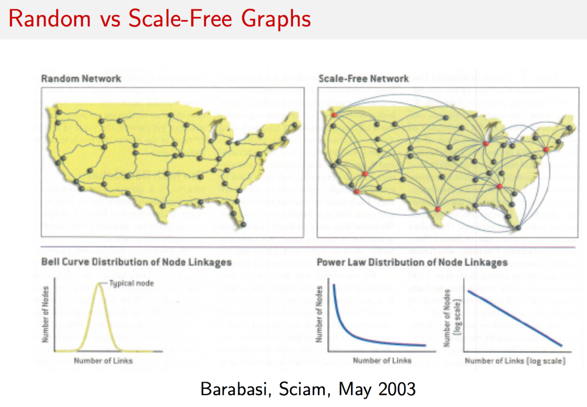
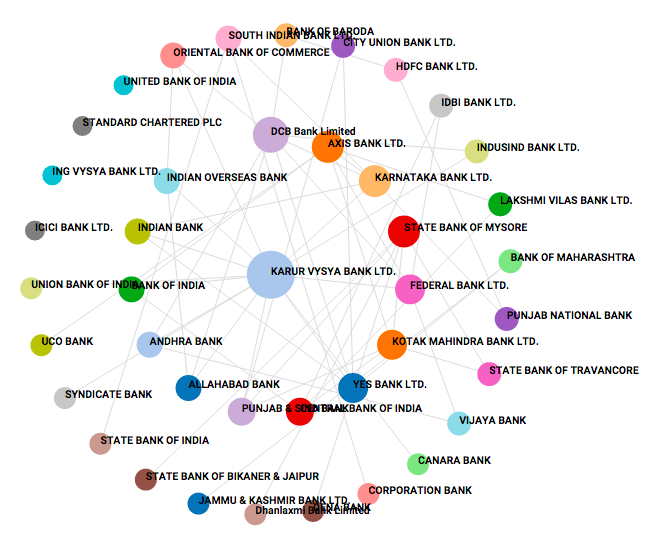

## Networks are beautiful


```{r NetworkPics2004conf, fig.cap='', fig.align='center', out.width='75%', fig.asp=0.8, echo=FALSE}

```


## Small Worlds


```{r SmallWorlds, fig.cap='', fig.align='center', out.width='75%', fig.asp=0.8, echo=FALSE}

```


## Academic Networks

http://academic.research.microsoft.com


```{r NetworkTypes, fig.cap='', fig.align='center', out.width='75%', fig.asp=0.8, echo=FALSE}

```


Useful introductory book on networks: http://www.cs.cornell.edu/home/kleinber/networks-book/

## Graphs

What is a graph? It is a picture of a network, a diagram consisting of relationships between entities. We call the entities as vertices or nodes (set $V$) and the relationships are called the edges of a graph (set $E$). Hence a graph $G$ is defined as

\begin{equation}
G = (V,E)
\end{equation}

### Types of graphs

If the edges $e \in E$ of a graph are not tipped with arrows implying some direction or causality, we call the graph an "undirected" graph. If there are arrows of direction then the graph is a "directed" graph. 

If the connections (edges) between vertices $v \in V$ have weights on them, then we call the graph a "weighted graph" else it's "unweighted". In an unweighted graph, for any pair of vertices $(u,v)$, we have

\begin{equation}
w(u,v) = \left\{
\begin{array}{ll}
w(u,v) = 1, & \mbox{  if } (u,v) \in E \\
w(u,v) = 0, & \mbox{  if } (u,v) \ni E
\end{array} \right.
\end{equation}

In a weighted graph the value of $w(u,v)$ is unrestricted, and can also be negative. 

Directed graphs can be cyclic or acyclic. In a cyclic graph there is a path from a source node that leads back to the node itself. Not so in an acyclic graph. The term **dag** is used to connote a "directed acyclic graph". The binomial option pricing model in finance that you have learnt is an example of a dag. 

## Adjacency Matrix

A graph may be represented by its adjacency matrix. This is simply  the matrix $A = \{w(u,v)\}, \forall u,v$. You can take the transpose of this matrix as well, which in the case of a directed graph will simply reverse the direction of all edges. 


```{r RandomScaleFree, fig.cap='', fig.align='center', out.width='75%', fig.asp=0.8, echo=FALSE}

```


```{r NetworkTypes2, fig.cap='', fig.align='center', out.width='75%', fig.asp=0.8, echo=FALSE}

```


## igraph package

```{r}
library(igraph)
```

```{r}
g = erdos.renyi.game(20,1/10)
g
```

```{r}
plot.igraph(g)
```

```{r}
print(clusters(g))
g$no[[1]]
```

## Graph Attributes

```{r}
#GENERATE RANDOM GRAPH
g = erdos.renyi.game(30,0.2)
plot(g)

#COMPUTE DEGREE DISTRIBUTION
dd = degree.distribution(g)
dd = as.matrix(dd)
d = as.matrix(seq(0,max(degree(g))))
plot(d,dd,type="l")
```

## Dijkstra's Shortest Paths Algorithm

This is one of the most well-known algorithms in theoretical computer science. Given a source vertex on a weighted, directed graph, it finds the shortest path to all other nodes from source $s$. The weight between two vertices is denoted $w(u,v)$ as before. Dijkstra's algorithm works for graphs where $w(u,v) \geq 0$. For negative weights, there is the Bellman-Ford algorithm.

For an excellent exposition of the algorithm in copious detail, see: https://medium.com/basecs/finding-the-shortest-path-with-a-little-help-from-dijkstra-613149fbdc8e

The algorithm is as follows.

function DIJKSTRA(G,w,s)   
   S = { }     
   %S = Set of vertices whose shortest paths from    
   %source s have been found    
   Q = V(G)    
   while Q notequal { } :  
      u = getMin(Q)  
      S = S + u  
      Q = Q - u  
      for each vertex v in SUCC(u):  
         if d[v] > d[u]+w(u,v) then:    
            d[v] = d[u]+w(u,v)   
            PRED(v) = u  

```{r}
#DIJSKATRA'S SHORTEST PATHS ALGORITHM
e = matrix(nc=3, byrow=TRUE, c(1,2,8, 1,4,4, 2,4,3, 4,2,1, 2,3,1, 2,5,7, 4,5,4, 3,5,1))
e
```

```{r}
g = graph.empty(5)
g = add.edges(g,t(e[,1:2]),weight=e[,3])
plot(g)
plot(g,edge.width=e[,3],edge.label=e[,3])
```

```{r}
get.shortest.paths(g,1)
```

```{r}
print(shortest.paths(g))
print(average.path.length(g))
```

```{r}
el <- matrix(nc=3, byrow=TRUE,c(0,1,0, 0,2,2, 0,3,1, 1,2,0, 1,4,5, 1,5,2, 2,1,1, 2,3,1, 2,6,1, 3,2,0, 
                                3,6,2, 4,5,2, 4,7,8, 5,2,2, 5,6,1, 5,8,1, 5,9,3, 7,5,1, 7,8,1, 8,9,4) )
el[,1:2] = el[,1:2]+1  #Note that the zero vertex option does not exist any more, so we added 1
g = add.edges(graph.empty(10), t(el[,1:2]), weight=el[,3])
plot(g)
```

```{r}
#GRAPHING MAIN NETWORK
g = simplify(g)
V(g)$name = seq(vcount(g))
#l = layout.fruchterman.reingold(g)
#l = layout.kamada.kawai(g)
l = layout.circle(g)
l = layout.norm(l, -1,1,-1,1)
#pdf(file="network_plot.pdf")
plot(g, layout=l, vertex.size=10, vertex.label=seq(1,10), vertex.color="#ff000033",  
        edge.color="grey", edge.arrow.size=0.75, rescale=FALSE, 
        xlim=range(l[,1]), ylim=range(l[,2]))
```

## D3 plots

D3 is a well known framework for plotting spring graphs. The following plot shows how one may use javascript in R, using the **html widgets** framework. See: http://www.htmlwidgets.org/

```{r}
library(networkD3)

links = data.frame(el[,1:2])-1
names(links) = c("source","target")
links$value = 1

nodes = data.frame(unique(c(links$target,links$source)))
names(nodes) = "name"
nodes$group = ceiling(3*runif(length(nodes$name)))

forceNetwork(Links = links, Nodes = nodes, Source = "source",
             Target = "target", Value = "value", NodeID = "name",
             Group = "group", opacity = 0.8, fontSize = 75)

```


## Centrality

Centrality is a property of vertices in the network. Given the adjacency matrix $A=\{w(u,v)\}$, we can obtain a measure of the "influence" of all vertices in the network. Let $x_i$ be the influence of vertex $i$. Then the column vector $x$ contains the influence of each vertex. What is influence? Think of a web page. It has more influence the more links it has both, to the page, and from the page to other pages. Or think of a alumni network. People with more connections have more influence, they are more "central". 

It is possible that you might have no connections yourself, but are connected to people with great connections. In this case, you do have influence. Hence, your influence depends on your own influence and that which you derive through others. Hence, the entire system of influence is interdependent, and can be written as the following matrix equation

\begin{equation}
x = A\;x 
\end{equation}

Now, we can just add a scalar here to this to get 

\begin{equation}
\xi \; x = A x
\end{equation}

an eigensystem. Decompose this to get the principle eigenvector, and its values give you the influence of each member. In this way you can find the most influential people in any network. There are several applications of this idea to real data. This is eigenvector centrality is exactly what Google trademarked as **PageRank**, even though they did not invent eigenvector centrality. 


```{r Centrality, fig.cap='', fig.align='center', out.width='75%', fig.asp=0.8, echo=FALSE}

```


```{r}
A = matrix(nc=3, byrow=TRUE, c(0,1,1, 1,0,1, 1,1,0))
print(A)
g = graph.adjacency(A,mode="undirected",weighted=TRUE,diag=FALSE)
res = evcent(g)
print(names(res))
```

```{r}
res$vector
```

```{r}
res = evcent(g,scale=FALSE)
res$vector
```

```{r}
A = matrix(nc=3, byrow=TRUE, c(0,1,1, 1,0,0, 1,0,0))
print(A)
g = graph.adjacency(A,mode="undirected",weighted=TRUE,diag=FALSE)
res = evcent(g,scale=FALSE)
res$vector
```

```{r}
A = matrix(nc=3, byrow=TRUE, c(0,2,1, 2,0,0, 1,0,0))
print(A)
g = graph.adjacency(A,mode="undirected",weighted=TRUE,diag=FALSE)
res = evcent(g,scale=FALSE)
res$vector
```

## Betweenness

Another concept of centrality is known as "betweenness". This is the proportion of shortest paths that go through a node relative to all paths that go through the same node. This may be expressed as

\begin{equation}
B(v) = \sum_{a \neq v \neq b} \frac{n_{a,b}(v)}{n_{a,b}}
\end{equation}

where $n_{a,b}$ is the number of shortest paths from node $a$ to node $b$, and $n_{a,b}(v)$ are the number of those paths that traverse through vertex $v$. Here is an example from an earlier directed graph. 

```{r}
el = matrix(nc=3, byrow=TRUE,
               c(0,1,1, 0,2,2, 0,3,1, 1,2,1, 1,4,5, 1,5,2, 2,1,1, 2,3,1,
                 2,6,1, 3,2,1, 3,6,2, 4,5,2, 4,7,8, 5,2,2, 5,6,1, 5,8,1,
                 5,9,3, 7,5,1, 7,8,1, 8,9,4) )
el[,1:2] = el[,1:2] + 1
g = add.edges(graph.empty(10), t(el[,1:2]), weight=el[,3])
plot(g)
res = betweenness(g)
res
```


```{r Diameter, fig.cap='', fig.align='center', out.width='75%', fig.asp=0.8, echo=FALSE}

```


```{r Fragility, fig.cap='', fig.align='center', out.width='75%', fig.asp=0.8, echo=FALSE}

```


```{r}
g = erdos.renyi.game(30,0.1)
d = seq(0,max(degree(g)))
dd = degree.distribution(g)
plot(g)
#DIAMETER
print(diameter(g))

#FRAGILITY
print((t(d^2) %*% dd)/(t(d) %*% dd))

#CENTRALITY
res = evcent(g)
res$vector
```


```{r WeakTies, fig.cap='', fig.align='center', out.width='75%', fig.asp=0.8, echo=FALSE}
knitr::include_graphics("DSTMAA_images/WeakTies.png")
```


```{r Communities, fig.cap='', fig.align='center', out.width='75%', fig.asp=0.8, echo=FALSE}
knitr::include_graphics("DSTMAA_images/Communities.png")
```


## Communities

Community detection methods partition nodes into clusters that tend to interact together. It is useful to point out the considerable flexibility and realism built into the definition of our community clusters. We do not require all nodes to belong to communities. Nor do we fix the number of communities that may exist at a time, and we also allow each community to have different size. 

With this flexibility, the key computational challenge is to find the "best" partition because the number of possible partitions of the nodes is extremely large. Community detection methods attempt to determine a set of clusters that are internally tight-knit.  Mathematically, this is equivalent to finding a partition of clusters to maximize the observed number of connections between cluster members minus what is expected conditional on the connections within the cluster, aggregated across all clusters. More formally, we choose partitions with high modularity $Q$, where

\begin{equation}
Q = \frac{1}{2m} \sum_{i,j} \left[ A_{ij} - \frac{d_i \times d_j}{2m} \right] \cdot \delta(i,j)
\end{equation}

$A_{ij}$ is the $(i,j)$-th entry in the adjacency matrix, i.e., the number of connections in which $i$ and $j$ jointly participated,  $d_i=\sum_j A_{ij}$ is the total number of transactions that node $i$ participated in (or, the degree of $i$) and $m = \frac{1}{2} \sum_{ij} A_{ij}$ is the sum of all edge weights in matrix $A$. 

The function $\delta(i,j)$ is an indicator equal to 1.0 if nodes $i$ and $j$ are from the same community, and zero otherwise. $Q$ is bounded in [-1, +1]. If $Q > 0$, intra-community connections exceed the expected number  given deal flow. 

Consider a network of five nodes $\{A,B,C,D,E\}$, where the edge weights are as follows: $A:B=6$, $A:C=5$, $B:C=2$, $C:D=2$, and $D:E=10$. Assume that a community detection algorithm assigns $\{A,B,C\}$ to one community and $\{D,E\}$ to another, i.e., only two communities. The adjacency matrix for this graph is given by matrix $A$ below.

```{r}
A = matrix(c(0,6,5,0,0,6,0,2,0,0,5,2,0,2,0,0,0,2,0,10,0,0,0,10,0),5,5)
print(A)
g = graph.adjacency(A,mode="undirected",weighted=TRUE,diag=FALSE)
wtc = walktrap.community(g)
res=membership(wtc)
print(res)
```

```{r}
g = graph.adjacency(A,mode="undirected",weighted=TRUE,diag=FALSE)
fgc = fastgreedy.community(g,merges=TRUE,modularity=TRUE,
           weights=E(g)$weight)
res = membership(fgc)
res
```


```{r Modularity, fig.cap='', fig.align='center', out.width='75%', fig.asp=0.8, echo=FALSE}

```


```{r}
g = graph.adjacency(A,mode="undirected",diag=FALSE)
wtc = walktrap.community(g)
res = membership(wtc)
print(res)
print(modularity(g,res))

#New functions in igraph for walktrap
res = cluster_walktrap(g)
print(res)
print(modularity(g,res$membership))
```

## Financial Applications


```{r MidasOverview, fig.cap='', fig.align='center', out.width='75%', fig.asp=0.8, echo=FALSE}
knitr::include_graphics("DSTMAA_images/MidasOverview.png")
```


```{r Midas_IO, fig.cap='', fig.align='center', out.width='75%', fig.asp=0.8, echo=FALSE}

```


```{r MidasDataModel, fig.cap='', fig.align='center', out.width='75%', fig.asp=0.8, echo=FALSE}

```


```{r Midas_Loan, fig.cap='', fig.align='center', out.width='75%', fig.asp=0.8, echo=FALSE}

```


```{r Midas2005, fig.cap='', fig.align='center', out.width='75%', fig.asp=0.8, echo=FALSE}

```


```{r Midas20062009, fig.cap='', fig.align='center', out.width='75%', fig.asp=0.8, echo=FALSE}
knitr::include_graphics("DSTMAA_images/Midas20062009.png")
```


```{r Midas_SIFI, fig.cap='', fig.align='center', out.width='75%', fig.asp=0.8, echo=FALSE}

```


## Risk Networks


```{r RiskNetworks, fig.cap='', fig.align='center', out.width='75%', fig.asp=0.8, echo=FALSE}

```


```{r}
#RISK NETWORKS PROGRAM CODE

#LOAD GRAPH NETWORK LIBRARY
library(igraph)

#FUNCTION FOR RISK INCREMENT AND DECOMP
NetRisk = function(Ri,X) {
  S = sqrt(t(Ri) %*% X %*% Ri)
  RiskIncr = 0.5 * (X %*% Ri + t(X) %*% Ri)/S[1,1]
  RiskDecomp = RiskIncr * Ri
  result = list(S,RiskIncr,RiskDecomp)
}
```

### Example

```{r}
#READ IN DATA
data = read.csv(file="DSTMAA_data/AdjacencyMatrix.csv",sep=",")
na = dim(data)[2]-1   #columns (assets)
nc = 20               #Number of controls
m = dim(data)[1]      #rows (first 1 is header, next n are assets, next 20 are controls, remaining are business lines, last line is weights)
nb = m-na-nc-2        #Number of business lines
X = data[2:(1+na),2:(na+1)]
X = matrix(as.numeric(as.matrix(X)),na,na)
controls = data[(2+na):(1+na+nc),2:(na+1)]
controls = matrix(as.numeric(as.matrix(controls)),nc,na)
Ri = matrix(colSums(controls),na,1)    #Aggregate risk by asset
bus = data[(2+na+nc):(m-1),2:(na+1)]
bus = matrix(as.numeric(as.matrix(bus)),nb,na)
bus_names = as.matrix(data[(2+na+nc):(m-1),1])
wts = data[m,2:(1+nb)]
wts = matrix(as.numeric(as.matrix(wts)),nb,1)/100   #percentage weights
```

```{r}
#TABLE OF ASSETS: Asset number, Asset name, IP address 
tab_assets = cbind(seq(1,na),names(data)[2:(na+1)],t(data[1,2:(na+1)]))
write(t(tab_assets),file="DSTMAA_data/tab_assets.txt",ncolumns=3)
```


```{r}
#GRAPH NETWORK: plot of the assets and the links with directed arrows
Y = X; diag(Y)=0
g = graph.adjacency(Y)
plot.igraph(g,layout=layout.fruchterman.reingold,edge.arrow.size=0.5,vertex.size=15,vertex.label=seq(1,na))
```

### Overall Risk Score

```{r}
#COMPUTE OVERALL RISK SCORE
#A computation that considers the risk level of each asset (Ri) 
#and the interlinkages between all assets (in adjacency matrix X)
#The function S below is homogenous of degree 1, i.e., S(m*Ri) = m*S(Ri)
S = sqrt(t(Ri) %*% X %*% Ri); print(c("Risk Score",S))
S
```

### Risk Decomposition


```{r RiskDecomp, fig.cap='', fig.align='center', out.width='75%', fig.asp=0.8, echo=FALSE}

```


```{r}
#COMPUTE RISK DECOMPOSITION
#Exploits the homogeneity degree 1 property to compute individual asset 
#risk contributions, i.e., a risk decomposition. 
#Risk increment is the change in total risk score if any one asset's
#risk level increases by 1. 
RiskIncr = 0.5 * (X %*% Ri + t(X) %*% Ri)/S[1,1]
RiskDecomp = RiskIncr * Ri
sorted_RiskDecomp = sort(RiskDecomp,decreasing=TRUE,index.return=TRUE)
RD = sorted_RiskDecomp$x
idxRD = sorted_RiskDecomp$ix
print("Risk Contribution"); print(RiskDecomp); print(sum(RiskDecomp))
barplot(t(RD),col="dark green",xlab="Node Number",names.arg=idxRD,cex.names=0.75)
```

### Centrality

```{r}
#NODE EIGEN VALUE CENTRALITY
#Centrality is a measure of connectedness and influence of a node in a network
#accounting for all its linkages and influence of all other nodes. Centrality
#is based on connections only and not risk scores, and measures the propensity
#of a node to propagate a security breach if the node is compromised.
#It is a score that is normalized to the range (0,1)
cent = evcent(g)$vector
print("Normalized Centrality Scores")
print(cent)
sorted_cent = sort(cent,decreasing=TRUE,index.return=TRUE)
Scent = sorted_cent$x
idxScent = sorted_cent$ix
barplot(t(Scent),col="dark red",xlab="Node Number",names.arg=idxScent,cex.names=0.75)
```

### Risk Increment


```{r Risk_Increments, fig.cap='', fig.align='center', out.width='75%', fig.asp=0.8, echo=FALSE}

```


```{r}
#COMPUTE RISK INCREMENTS
sorted_RiskIncr = sort(RiskIncr,decreasing=TRUE,index.return=TRUE)
RI = sorted_RiskIncr$x
idxRI = sorted_RiskIncr$ix
print("Risk Increment (per unit increase in any node risk"); print(RiskIncr)
barplot(t(RI),col="dark blue",xlab="Node Number",names.arg=idxRI,cex.names=0.75)
```

### Criticality


```{r Criticality, fig.cap='', fig.align='center', out.width='75%', fig.asp=0.8, echo=FALSE}
knitr::include_graphics("DSTMAA_images/Criticality.png")
```


```{r}
#CRITICALITY
#Criticality is compromise-weighted centrality. 
#This is an element-wise multiplication of vectors $C$ and $x$. 
crit = Ri * cent
print("Criticality Vector")
print(crit) 
sorted_crit = sort(crit,decreasing=TRUE,index.return=TRUE)
Scrit = sorted_crit$x
idxScrit = sorted_crit$ix
barplot(t(Scrit),col="orange",xlab="Node Number",names.arg=idxScrit,cex.names=0.75)
```

### Cross Risk

### Risk Scaling: Spillovers


```{r CrossRisk, fig.cap='', fig.align='center', out.width='75%', fig.asp=0.8, echo=FALSE}
knitr::include_graphics("DSTMAA_images/CrossRisk.png")
```


```{r,eval=FALSE}
#CROSS IMPACT MATRIX
#CHECK FOR SPILLOVER EFFECTS FROM ONE NODE TO ALL OTHERS
d_RiskDecomp = NULL
n = length(Ri)
for (j in 1:n) {
  Ri2 = Ri
  Ri2[j] = Ri[j]+1
  res = NetRisk(Ri2,X)
  d_Risk = as.matrix(res[[3]]) - RiskDecomp
  d_RiskDecomp = cbind(d_RiskDecomp,d_Risk)  #Column by column for each asset
}
#3D plots
library("RColorBrewer"); library("lattice"); library("latticeExtra")
cloud(d_RiskDecomp, 
      panel.3d.cloud = panel.3dbars,
      xbase = 0.25, ybase = 0.25, 
      zlim = c(min(d_RiskDecomp), max(d_RiskDecomp)),
      scales = list(arrows = FALSE, just = "right"), 
      xlab = "On", ylab = "From", zlab = NULL, main="Change in Risk Contribution",
      col.facet = level.colors(d_RiskDecomp, at = do.breaks(range(d_RiskDecomp), 20),
                               col.regions = cm.colors, colors = TRUE),
      colorkey = list(col = cm.colors, at = do.breaks(range(d_RiskDecomp), 20)),
      #screen = list(z = 40, x = -30)
      )
```

```{r,eval=FALSE}
brewer.div <- colorRampPalette(brewer.pal(11, "Spectral"), interpolate = "spline")
levelplot(d_RiskDecomp, aspect = "iso", col.regions = brewer.div(20),
          ylab="Impact from", xlab="Impact on", main="Change in Risk Contribution")
```

### Risk Scaling with Increased Connectivity


```{r RiskScaling, fig.cap='', fig.align='center', out.width='75%', fig.asp=0.8, echo=FALSE}

```


```{r}
#SIMULATION OF EFFECT OF INCREASED CONNECTIVITY
#RANDOM GRAPHS 
n=50; k=100; pvec=seq(0.05,0.50,0.05); svec=NULL; sbarvec=NULL 
for (p in pvec) {
  s_temp = NULL
  sbar_temp = NULL
  for (j in 1:k) {
    g = erdos.renyi.game(n,p,directed=TRUE);
    A = get.adjacency(g)
    diag(A) = 1
    c = as.matrix(round(runif(n,0,2),0))
    syscore = as.numeric(sqrt(t(c) %*% A %*% c))
    sbarscore = syscore/n
    s_temp = c(s_temp,syscore)
    sbar_temp = c(sbar_temp,sbarscore)
  }
  svec = c(svec,mean(s_temp))
  sbarvec = c(sbarvec,mean(sbar_temp))
}
#plot(pvec,svec,type="l",xlab="Prob of connecting to a node",ylab="S",lwd=3,col="red")
plot(pvec,sbarvec,type="l",xlab="Prob of connecting to a node",ylab="S_Avg",lwd=3,col="red")
```

### Too Big To Fail 

The change in risk score ${S}$ as the number of nodes increases, while keeping the average number of connections between nodes constant. This mimics the case where banks are divided into smaller banks, each of which then contains part of the transacting volume of the previous bank. The plot shows how the risk score increases as the number of nodes increases from 10 to 100, while expected number of total edges in the network remains the same. A compromise vector is also generated with equally likely values $\{0,1,2\}$. This is repeated 5000 times for each fixed number of nodes and the mean risk score across 5000 simulations.

```{r}
#SIMULATION OF EFFECT OF INCREASED NODES AND REDUCED CONNECTIVITY
nvec=seq(10,100,10); k=100; svec=NULL; sbarvec=NULL 
for (n in nvec) {
  s_temp = NULL
  sbar_temp = NULL
  p = 5/n
  for (j in 1:k) {
    g = erdos.renyi.game(n,p,directed=TRUE);
    A = get.adjacency(g)
    diag(A) = 1
    c = as.matrix(round(runif(n,0,2),0))
    syscore = as.numeric(sqrt(t(c) %*% A %*% c))
    sbarscore = syscore/n
    s_temp = c(s_temp,syscore)
    sbar_temp = c(sbar_temp,sbarscore)
  }
  svec = c(svec,mean(s_temp))  
  sbarvec = c(sbarvec,mean(sbar_temp))  
}
plot(nvec,svec,type="l",xlab="Number of nodes",ylab="S",ylim=c(0,max(svec)),lwd=3,col="red")
#plot(nvec,sbarvec,type="l",xlab="Number of nodes",ylab="S_Avg",ylim=c(0,max(sbarvec)),lwd=3,col="red")
```

## Systemic Risk in Indian Banks


```{r SR_dashboard, fig.cap='', fig.align='center', out.width='75%', fig.asp=0.8, echo=FALSE}

```

```{r SR_network, fig.cap='', fig.align='center', out.width='75%', fig.asp=0.8, echo=FALSE}

```

```{r SR_network2, fig.cap='', fig.align='center', out.width='75%', fig.asp=0.8, echo=FALSE}

```

```{r SR_decomposition, fig.cap='', fig.align='center', out.width='75%', fig.asp=0.8, echo=FALSE}
knitr::include_graphics("DSTMAA_images/SR_decomposition.png")
```

```{r SR_timeseries, fig.cap='', fig.align='center', out.width='75%', fig.asp=0.8, echo=FALSE}

```


## Systemic Risk Portals

http://www.systemic-risk.org/

http://www.systemic-risk-hub.org/risk_centers.php

## Shiny application

The example above may also be embedded in a shiny application for which the code is provided below. The screen will appear as follows. 

```{r syst_shiny1, fig.cap='', fig.align='center', out.width='75%', fig.asp=0.8, echo=FALSE}

```


```{r syst_shiny2, fig.cap='', fig.align='center', out.width='75%', fig.asp=0.8, echo=FALSE}

```

The files below also require the data file **systemicR.csv** or an upload. 

```{r,eval=FALSE}
#SERVER.R

library(shiny)
library(plotly)
library(igraph)

# Define server logic for random distribution application
shinyServer(function(input, output) {
  
  
  fData = reactive({
    
    # input$file1 will be NULL initially. After the user selects and uploads a 
    # file, it will be a data frame with 'name', 'size', 'type', and 'datapath' 
    # columns. The 'datapath' column will contain the local filenames where the 
    # data can be found.
    
    inFile <- input$file
    
    if (is.null(inFile)){
    data = read.csv(file="systemicR.csv",sep=",")    
    }
    else
      read.csv(file=inFile$datapath)
  })
  
  
  observeEvent(input$compute, {
    
    
    output$text1 <- renderText({ 
      data = fData()
      na = dim(data)[1]   #columns (assets)
      Ri = matrix(data[,1],na,1)    #Aggregate risk by asset
      X = data[1:na,2:(na+1)]
      X = matrix(as.numeric(as.matrix(X)),na,na)
      S = as.numeric(sqrt(t(Ri) %*% X %*% Ri)) 
      paste("Overall Risk Score",round(S,2))
    })
    
    output$plot <- renderPlot({
      data = fData()
      na = dim(data)[1]   #columns (assets)
      bnames = names(data)
      Ri = matrix(data[,1],na,1)    #Aggregate risk by asset
      X = data[1:na,2:(na+1)]
      X = matrix(as.numeric(as.matrix(X)),na,na)

      #GRAPH NETWORK: plot of the assets and the links with directed arrows
      Y = X; diag(Y)=0
      g = graph.adjacency(Y)
      V(g)$color = "#ffec78"
      V(g)$color[degree(g)==max(degree(g))] = "#ff4040"
      V(g)$color[degree(g)==min(degree(g))] = "#b4eeb4"
      V(g)$size = Ri*8+10
      
      plot.igraph(g,layout=layout.fruchterman.reingold,edge.arrow.size=0.5,
                  vertex.label.color="black",edge.arrow.width=0.8,
                  vertex.label=bnames[1:na+1],
                  vertex.label.cex=0.8)
    }, height = 550, width = 800)
    
    output$text2 <- renderText({ 
      data = fData()
      na = dim(data)[1]   #columns (assets)
      Ri = matrix(data[,1],na,1)    #Aggregate risk by asset
      X = data[1:na,2:(na+1)]
      X = matrix(as.numeric(as.matrix(X)),na,na)
      Y = X; diag(Y)=0
      g = graph.adjacency(Y)
      H = ((sum(degree(g)^2))/na)/((sum(degree(g)))/na)
      paste("Fragility of the Network is ",round(H,2))
    })
    
    output$plot2 <- renderPlotly({
      data = fData()
      na = dim(data)[1]   #columns (assets)
      Ri = matrix(data[,1],na,1)    #Aggregate risk by asset
      X = data[1:na,2:(na+1)]
      X = matrix(as.numeric(as.matrix(X)),na,na)
      S = as.numeric(sqrt(t(Ri) %*% X %*% Ri)) 
      RiskIncr = 0.5 * as.numeric((X %*% Ri + t(X) %*% Ri))/S
      RiskDecomp = RiskIncr * Ri

      sorted_RiskDecomp = sort(RiskDecomp,decreasing=TRUE,index.return=TRUE)
      RD = as.numeric(as.matrix(sorted_RiskDecomp$x))
      idxRD = as.character(as.matrix(sorted_RiskDecomp$ix))
      idxRD = paste("B",idxRD,sep="")
      
      xAx <- list(
        title = "Node Number"
      )
      yAx <- list(
        title = "Risk Decomposition")
      plot_ly(y = RD,x = idxRD,marker = list(color = toRGB("dark green")),type="bar")%>%
              layout(xaxis = xAx, yaxis = yAx)
#      barplot(t(RD),col="dark green",xlab="Node Number",names.arg=idxRD,cex.names=0.75)   
      
          })
    
    output$plot3 <- renderPlotly({
      data = fData()
      na = dim(data)[1]   #columns (assets)
      Ri = matrix(data[,1],na,1)    #Aggregate risk by asset
      X = data[1:na,2:(na+1)]
      X = matrix(as.numeric(as.matrix(X)),na,na)
      
      #GRAPH NETWORK: plot of the assets and the links with directed arrows
      Y = X; diag(Y)=0
      g = graph.adjacency(Y)
      cent = evcent(g)$vector
      #  print("Normalized Centrality Scores")
      sorted_cent = sort(cent,decreasing=TRUE,index.return=TRUE)
      Scent = sorted_cent$x
      idxScent = sorted_cent$ix
      idxScent = paste("B",idxScent,sep="")
      
      
      xAx <- list(
        title = "Node Number"
      )
      yAx <- list(
        title = "Eigen Value Centrality"
      )
     plot_ly(y = as.numeric(t(Scent)),x = idxScent,marker = list(color = toRGB("red")),type="bar")%>%
              layout(xaxis = xAx, yaxis = yAx)
#    barplot(t(Scent),col="dark red",xlab="Node Number",names.arg=idxScent,cex.names=0.75)
      
    })
    
      
    
    output$plot4 <- renderPlotly({
      data = fData()
      na = dim(data)[1]   #columns (assets)
      Ri = matrix(data[,1],na,1)    #Aggregate risk by asset
      X = data[1:na,2:(na+1)]
      X = matrix(as.numeric(as.matrix(X)),na,na)
      
      S = as.numeric(sqrt(t(Ri) %*% X %*% Ri)) 
      RiskIncr = 0.5 * as.numeric((X %*% Ri + t(X) %*% Ri))/S
      
      #COMPUTE RISK INCREMENTS
      sorted_RiskIncr = sort(RiskIncr,decreasing=TRUE,index.return=TRUE)
      RI = sorted_RiskIncr$x
      idxRI = sorted_RiskIncr$ix
      idxRI = paste("B",idxRI,sep="")
      
      
      xAx <- list(
        title = "Node Number"
      )
      yAx <- list(
        title = "Risk Increments"
      )
      plot_ly(y = as.numeric(t(RI)),x = idxRI,marker = list(color = toRGB("green")),type="bar")%>%
              layout(xaxis = xAx, yaxis = yAx)
      
#        barplot(t(RI),col="dark blue",xlab="Node Number",names.arg=idxRI,cex.names=0.75)    
    
      })
    
    
    #CRITICALITY
    #Criticality is compromise-weighted centrality. 
    #This is an element-wise multiplication of vectors $C$ and $x$. 
    
    output$plot5 <- renderPlotly({
      data = fData()
      na = dim(data)[1]   #columns (assets)
      Ri = matrix(data[,1],na,1)    #Aggregate risk by asset
      X = data[1:na,2:(na+1)]
      X = matrix(as.numeric(as.matrix(X)),na,na)

      #GRAPH NETWORK: plot of the assets and the links with directed arrows
      Y = X; diag(Y)=0
      g = graph.adjacency(Y)
      cent = evcent(g)$vector
      
      crit = Ri * cent
      print("Criticality Vector")
      print(crit) 
      sorted_crit = sort(crit,decreasing=TRUE,index.return=TRUE)
      Scrit = sorted_crit$x
      idxScrit = sorted_crit$ix
      idxScrit = paste("B",idxScrit,sep="")
      
      
      xAx <- list(
        title = "Node Number"
      )
      yAx <- list(
        title = "Criticality Vector"
      )
      plot_ly(y = as.numeric(t(sorted_crit$x)),x = idxScrit,marker = list(color = toRGB("orange")),type="bar")%>%
              layout(xaxis = xAx, yaxis = yAx)
      
#          barplot(t(Scrit),col="orange",xlab="Node Number",names.arg=idxScrit,cex.names=0.75)
    })
    
  })
  
})
```

```{r,eval=FALSE}
#UI.R

library(plotly)
shinyUI(fluidPage(
  
  titlePanel("Systemic Risk Scoring"),
  
  sidebarLayout(
    
    sidebarPanel(
      # Inputs excluded for brevity
      p('Upload a .csv file having header as Credit Scores and names of n banks. Dimensions of file will be
        (n*n+1) excluding the header.'),
      fileInput("file", label = h3("File input")),
      actionButton("compute","Compute Scores"),
      hr(),
      textOutput("text1"),
      textOutput("text2"),
      hr(),
      p('Please refer following Paper published for further details',
        a("Matrix Metrics: Network-Based Systemic Risk Scoring.", 
          href = "http://srdas.github.io/Papers/JAI_Das_issue.pdf"))
    ),
    
    mainPanel(
      tabsetPanel(
        tabPanel("Network Graph", plotOutput("plot",width="100%")), 
        tabPanel("Risk Decomposition", plotlyOutput("plot2")), 
        tabPanel("Node Centrality", plotlyOutput("plot3")), 
        tabPanel("Risk Increments", plotlyOutput("plot4")),
        tabPanel("Criticality", plotlyOutput("plot5"))

      )
    )
  )
))
```
